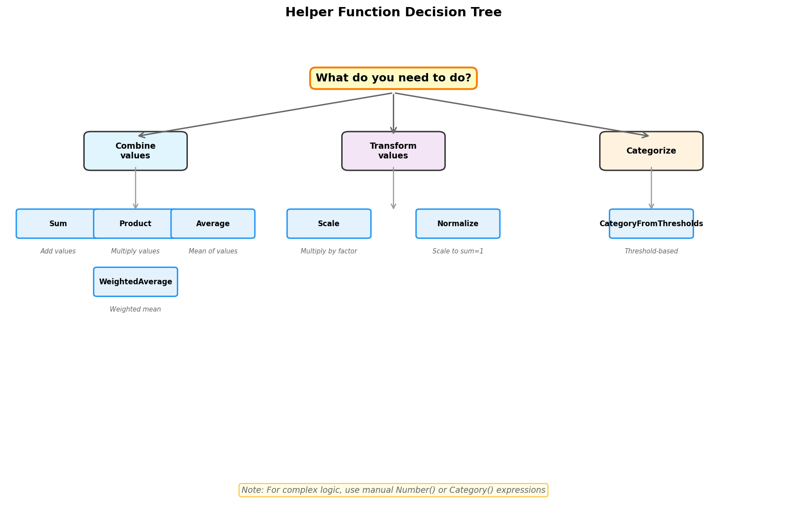

Helper Functions Guide
======================

Pollywog provides a collection of helper functions to simplify common calculation patterns. These functions generate properly formatted ``Number`` or ``Category`` objects that you can include in your ``CalcSet``.

|

Why Use Helpers?
----------------

Helper functions offer several advantages:

1. **Readability**: ``Sum("Au", "Ag", "Cu")`` is clearer than manually writing the expression
2. **Consistency**: Helpers ensure correct syntax and parentheses
3. **Error Prevention**: Reduce mistakes in complex expressions
4. **Maintainability**: Easier to update and refactor calculations
5. **Self-Documentation**: Helper names clearly indicate intent

All helper functions are available from the ``pollywog.helpers`` module:

.. code-block:: python

    from pollywog.helpers import Sum, Product, Average, WeightedAverage, Scale, Normalize, CategoryFromThresholds

Mathematical Helpers
--------------------

Sum
~~~

Add multiple variables together.

.. code-block:: python

    from pollywog.helpers import Sum
    
    # Sum of multiple metals
    total = Sum("Au", "Ag", "Cu", name="total_metals")
    # Generates: ([Au] + [Ag] + [Cu])
    
    # Can also pass a list
    metals = ["Au", "Ag", "Cu", "Pb", "Zn"]
    total_all = Sum(metals, name="total_all_metals")
    
    # Custom comment
    with_comment = Sum("Au", "Ag", name="precious_metals", 
                       comment="Combined precious metals")

**Parameters:**

- ``*variables``: Variable names as strings, or a single list of variable names
- ``name`` (optional): Name for output variable (default: ``sum_<var1>_<var2>_...``)
- ``comment`` (optional): Custom comment for the calculation

**Returns:** ``Number`` object

Product
~~~~~~~

Multiply multiple variables together.

.. code-block:: python

    from pollywog.helpers import Product
    
    # Grade times recovery times tonnage
    payable = Product("grade", "recovery", "tonnes", name="payable_metal")
    # Generates: ([grade] * [recovery] * [tonnes])
    
    # Area calculation
    area = Product("length", "width", name="block_area")

**Parameters:**

- ``*variables``: Variable names as strings, or a single list of variable names
- ``name`` (optional): Name for output variable (default: ``prod_<var1>_<var2>_...``)
- ``comment`` (optional): Custom comment for the calculation

**Returns:** ``Number`` object

Average
~~~~~~~

Calculate the arithmetic mean of multiple variables.

.. code-block:: python

    from pollywog.helpers import Average
    
    # Average of multiple estimates
    avg_grade = Average("Au_kriging", "Au_idw", "Au_nn", name="Au_average")
    # Generates: ([Au_kriging] + [Au_idw] + [Au_nn]) / 3
    
    # Average across domains
    domains = ["oxide", "transition", "sulfide"]
    avg_domain = Average([f"grade_{d}" for d in domains], name="avg_grade")

**Parameters:**

- ``*variables``: Variable names as strings, or a single list of variable names
- ``name`` (optional): Name for output variable (default: ``avg_<var1>_<var2>_...``)
- ``comment`` (optional): Custom comment for the calculation

**Returns:** ``Number`` object

WeightedAverage
~~~~~~~~~~~~~~~

Calculate a weighted average of variables. Essential for domain proportion calculations.

.. code-block:: python

    from pollywog.helpers import WeightedAverage
    
    # Weighted by domain proportions
    weighted_grade = WeightedAverage(
        variables=["Au_oxide", "Au_sulfide", "Au_transition"],
        weights=["prop_oxide", "prop_sulfide", "prop_transition"],
        name="Au_composite"
    )
    # Generates: ([Au_oxide] * [prop_oxide] + [Au_sulfide] * [prop_sulfide] + 
    #             [Au_transition] * [prop_transition]) / 
    #            ([prop_oxide] + [prop_sulfide] + [prop_transition])
    
    # With constant weights
    method_blend = WeightedAverage(
        variables=["Au_kriging", "Au_idw"],
        weights=[0.7, 0.3],
        name="Au_blended"
    )
    # Generates: ([Au_kriging] * 0.7 + [Au_idw] * 0.3) / (0.7 + 0.3)

**Parameters:**

- ``variables``: List of variable names to average
- ``weights``: List of weights (can be variable names or numeric constants)
- ``name`` (optional): Name for output variable (default: ``wavg_<var1>_<var2>_...``)
- ``comment`` (optional): Custom comment for the calculation

**Returns:** ``Number`` object

**Important:** Weights are automatically summed in the denominator, so they don't need to sum to 1.

Scale
~~~~~

Multiply a variable by a scaling factor.

.. code-block:: python

    from pollywog.helpers import Scale
    
    # Apply dilution factor
    diluted = Scale("Au_est", 0.95, name="Au_diluted")
    # Generates: [Au_est] * 0.95
    
    # Scale by another variable
    adjusted = Scale("grade", "adjustment_factor", name="grade_adjusted")
    # Generates: [grade] * [adjustment_factor]

**Parameters:**

- ``variable``: Variable name to scale
- ``factor``: Scaling factor (number or variable name)
- ``name`` (optional): Name for output variable (default: ``scale_<variable>``)
- ``comment`` (optional): Custom comment for the calculation

**Returns:** ``Number`` object

Normalize
~~~~~~~~~

Normalize a variable to the range [0, 1] given min and max values.

.. code-block:: python

    from pollywog.helpers import Normalize
    
    # Normalize grade to 0-1 range
    norm_grade = Normalize("Au", min_value=0, max_value=10, name="Au_normalized")
    # Generates: ([Au] - 0) / (10 - 0)
    
    # Normalize depth
    norm_depth = Normalize("depth", min_value=0, max_value=500, name="depth_norm")

**Parameters:**

- ``variable``: Variable name to normalize
- ``min_value``: Minimum value for normalization
- ``max_value``: Maximum value for normalization
- ``name`` (optional): Name for output variable (default: ``norm_<variable>``)
- ``comment`` (optional): Custom comment for the calculation

**Returns:** ``Number`` object

**Note:** If the variable equals min_value, result is 0. If it equals max_value, result is 1.

Classification Helpers
----------------------

CategoryFromThresholds
~~~~~~~~~~~~~~~~~~~~~~

Create categorical classifications based on numeric thresholds. Perfect for grade shells, ore types, and quality classifications.

.. code-block:: python

    from pollywog.helpers import CategoryFromThresholds
    
    # Classify ore grade
    ore_class = CategoryFromThresholds(
        variable="Au",
        thresholds=[0.3, 1.0, 3.0],
        categories=["waste", "low_grade", "medium_grade", "high_grade"],
        name="Au_class"
    )
    # Creates an If statement:
    # If Au <= 0.3: "waste"
    # Else if Au <= 1.0: "low_grade"
    # Else if Au <= 3.0: "medium_grade"
    # Else: "high_grade"
    
    # Rock quality designation
    rqd_class = CategoryFromThresholds(
        variable="RQD",
        thresholds=[25, 50, 75, 90],
        categories=["very_poor", "poor", "fair", "good", "excellent"],
        name="rock_quality",
        comment="RQD classification per Deere, 1989"
    )

**Parameters:**

- ``variable``: Variable to threshold
- ``thresholds``: List of threshold values (must be sorted in ascending order)
- ``categories``: List of category labels (length must be ``len(thresholds) + 1``)
- ``name`` (optional): Name for output category (default: ``class_<variable>``)
- ``comment`` (optional): Custom comment for the calculation

**Returns:** ``Category`` object

**Important:** 
- Thresholds must be in ascending order
- Number of categories must be one more than number of thresholds
- Categories below or equal to first threshold get first label
- Categories above last threshold get last label

Using Helpers in Workflows
---------------------------

Combining Multiple Helpers
~~~~~~~~~~~~~~~~~~~~~~~~~~~

Helpers work well together to build complex calculations:

.. code-block:: python

    from pollywog.core import CalcSet
    from pollywog.helpers import WeightedAverage, Product, CategoryFromThresholds
    
    # Multi-metal resource estimation
    domains = ["oxide", "transition", "sulfide"]
    
    calcset = CalcSet([
        # Weighted grades by domain
        WeightedAverage(
            variables=[f"Au_{d}" for d in domains],
            weights=[f"prop_{d}" for d in domains],
            name="Au_composite"
        ),
        WeightedAverage(
            variables=[f"Cu_{d}" for d in domains],
            weights=[f"prop_{d}" for d in domains],
            name="Cu_composite"
        ),
        
        # Payable metal
        Product("Au_composite", "recovery_Au", "tonnes", name="Au_payable_oz"),
        Product("Cu_composite", "recovery_Cu", "tonnes", name="Cu_payable_lbs"),
        
        # Classification
        CategoryFromThresholds(
            variable="Au_composite",
            thresholds=[0.5, 1.5],
            categories=["low", "medium", "high"],
            name="grade_class"
        ),
    ])
    
    calcset.to_lfcalc("multi_metal_workflow.lfcalc")

Programmatic Generation
~~~~~~~~~~~~~~~~~~~~~~~~

Use Python loops to generate many similar calculations:

.. code-block:: python

    from pollywog.core import CalcSet
    from pollywog.helpers import WeightedAverage, Scale
    
    metals = ["Au", "Ag", "Cu", "Pb", "Zn"]
    domains = ["high_grade", "medium_grade", "low_grade"]
    
    calculations = []
    
    # Weighted average for each metal
    for metal in metals:
        calculations.append(
            WeightedAverage(
                variables=[f"{metal}_{d}" for d in domains],
                weights=[f"prop_{d}" for d in domains],
                name=f"{metal}_composite",
                comment=f"Domain-weighted {metal} grade"
            )
        )
    
    # Apply recovery factor to each metal
    recovery_factors = {
        "Au": 0.88, "Ag": 0.75, "Cu": 0.85, "Pb": 0.80, "Zn": 0.82
    }
    
    for metal in metals:
        calculations.append(
            Scale(
                f"{metal}_composite",
                recovery_factors[metal],
                name=f"{metal}_recovered",
                comment=f"{metal} grade after {recovery_factors[metal]*100:.0f}% recovery"
            )
        )
    
    # Create and export calcset
    calcset = CalcSet(calculations)
    calcset.to_lfcalc("automated_workflow.lfcalc")

When to Use Helpers vs. Manual Expressions
-------------------------------------------

**Use Helpers When:**

- The calculation matches a helper pattern (sum, average, product, etc.)
- You want readable, self-documenting code
- You're generating many similar calculations programmatically
- You want to minimize syntax errors

**Use Manual Expressions When:**

- The calculation is unique or complex
- You need fine control over the expression
- The calculation doesn't fit any helper pattern
- You need to use specific Leapfrog functions (clamp, log, etc.)

Example comparing both approaches:

.. code-block:: python

    from pollywog.core import CalcSet, Number
    from pollywog.helpers import Sum, Product
    
    # Using helpers (recommended for simple patterns)
    helper_approach = CalcSet([
        Sum("Au", "Ag", "Cu", name="total_metals"),
        Product("grade", "tonnage", name="metal_tonnes"),
    ])
    
    # Using manual expressions (needed for complex logic)
    manual_approach = CalcSet([
        Number(name="complex_calc", children=[
            "log([Au] + 0.01) * clamp([recovery], 0.5, 1.0) + [base_adjustment]"
        ]),
    ])
    
    # Combining both approaches
    mixed_approach = CalcSet([
        Sum("Au", "Ag", name="precious"),  # Helper for simple sum
        Number(name="adjusted_value", children=[  # Manual for complex expression
            "[precious] * clamp([price_ratio], 0, 5) + [premium]"
        ]),
    ])

Custom Helper Functions
-----------------------

You can create your own helper functions following the same pattern:

.. code-block:: python

    from pollywog.core import Number
    
    def GradeThickness(grade_var, thickness_var, name=None, comment=None):
        """
        Calculate grade-thickness product (common in vein modeling).
        """
        if name is None:
            name = f"GT_{grade_var}"
        expr = f"[{grade_var}] * [{thickness_var}]"
        return Number(
            name,
            [expr],
            comment_equation=comment or f"Grade-thickness product for {grade_var}"
        )
    
    def MetalValue(grade_var, price, recovery=1.0, name=None, comment=None):
        """
        Calculate metal value per tonne.
        """
        if name is None:
            name = f"value_{grade_var}"
        expr = f"[{grade_var}] * {price} * {recovery} / 31.1035"
        return Number(
            name,
            [expr],
            comment_equation=comment or f"Metal value for {grade_var} at ${price}/oz"
        )
    
    # Use your custom helpers
    from pollywog.core import CalcSet
    
    calcset = CalcSet([
        GradeThickness("Au", "vein_width", name="Au_GT"),
        MetalValue("Au", 1800, recovery=0.88, name="Au_value_per_tonne"),
    ])

Helper Function Reference
--------------------------

Quick reference table:

+------------------------+------------------+------------------------------------------+
| Helper                 | Returns          | Use Case                                 |
+========================+==================+==========================================+
| Sum                    | Number           | Add multiple variables                   |
+------------------------+------------------+------------------------------------------+
| Product                | Number           | Multiply multiple variables              |
+------------------------+------------------+------------------------------------------+
| Average                | Number           | Arithmetic mean                          |
+------------------------+------------------+------------------------------------------+
| WeightedAverage        | Number           | Weighted mean (domain proportions)       |
+------------------------+------------------+------------------------------------------+
| Scale                  | Number           | Multiply by factor (dilution, recovery)  |
+------------------------+------------------+------------------------------------------+
| Normalize              | Number           | Scale to [0, 1] range                    |
+------------------------+------------------+------------------------------------------+
| CategoryFromThresholds | Category         | Classify by numeric thresholds           |
+------------------------+------------------+------------------------------------------+

Common Patterns
---------------

Domain Proportion Weighting
~~~~~~~~~~~~~~~~~~~~~~~~~~~~

.. code-block:: python

    from pollywog.helpers import WeightedAverage
    
    domains = ["dom1", "dom2", "dom3"]
    metals = ["Au", "Ag", "Cu"]
    
    calcs = [
        WeightedAverage(
            variables=[f"{metal}_{d}" for d in domains],
            weights=[f"prop_{d}" for d in domains],
            name=f"{metal}_final"
        )
        for metal in metals
    ]

Multi-Step Calculations
~~~~~~~~~~~~~~~~~~~~~~~~

.. code-block:: python

    from pollywog.core import CalcSet
    from pollywog.helpers import Product, Scale
    
    CalcSet([
        # Step 1: Apply dilution
        Scale("Au_est", 0.95, name="Au_diluted"),
        
        # Step 2: Apply recovery
        Scale("Au_diluted", 0.88, name="Au_recovered"),
        
        # Step 3: Calculate metal content
        Product("Au_recovered", "tonnes", name="Au_ounces_total"),
    ])

Economic Calculations
~~~~~~~~~~~~~~~~~~~~~

.. code-block:: python

    from pollywog.core import CalcSet, Number
    from pollywog.helpers import Sum, Product
    
    CalcSet([
        # Revenue per tonne for each metal
        Product("Au_recovered", "Au_price", name="Au_revenue_per_oz"),
        Product("Cu_recovered", "Cu_price", name="Cu_revenue_per_lb"),
        
        # Convert to $/tonne
        Number(name="Au_value", children=["[Au_revenue_per_oz] / 31.1035"]),
        Number(name="Cu_value", children=["[Cu_revenue_per_lb] * 22.046"]),
        
        # Total revenue
        Sum("Au_value", "Cu_value", name="total_revenue_per_tonne"),
    ])

See Also
--------

- :doc:`expression_syntax` - Full expression syntax reference
- :doc:`workflow_patterns` - Common workflow examples
- :doc:`api_reference` - Complete API documentation
- :doc:`tutorials` - Step-by-step tutorials
