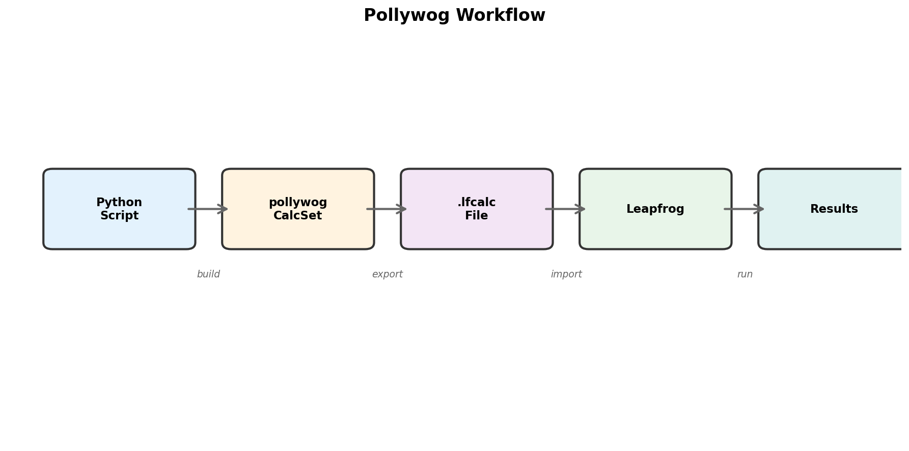
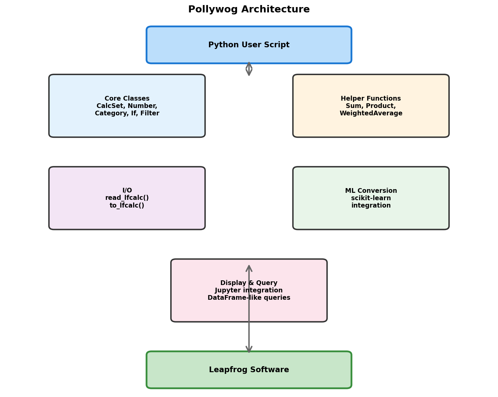

Welcome to pollywog's documentation!
====================================

.. toctree::
   :maxdepth: 2
   :caption: Getting Started

   getting_started
   tutorials

.. toctree::
   :maxdepth: 2
   :caption: User Guide

   expression_syntax
   workflow_patterns
   helpers_guide
   best_practices

.. toctree::
   :maxdepth: 2
   :caption: Reference

   api_reference

Introduction
------------

**pollywog** is a Python library designed to make it easy to build, manipulate, and visually inspect Leapfrog-style calculation sets—especially when those sets are large, complex, or involve repetitive logic.

|

What is Leapfrog?
~~~~~~~~~~~~~~~~~

Leapfrog is industry-leading 3D geological modeling and mine planning software developed by Seequent. It is widely used in mining and resource estimation for:

- Drillhole database management and visualization
- Geological modeling (surfaces, solids, block models)
- Grade estimation (kriging, IDW, nearest neighbor)
- Resource and reserve calculation
- Mine planning and design

Leapfrog uses **calculation sets** (.lfcalc files) to define formulas and transformations applied to data. These calculations can become complex when dealing with multiple domains, conditional logic, and multi-commodity resources.

Problems pollywog solves
~~~~~~~~~~~~~~~~~~~~~~~~~

- **Building large calculation sets:** Writing and maintaining hundreds of calculations by hand in Leapfrog can be error-prone and tedious. pollywog lets you generate, organize, and refactor these sets programmatically in Python.
- **Complicated logic:** Many workflows require conditional logic, grouping, and dependencies between variables. pollywog provides constructs like ``If`` blocks, ``Category`` grouping, and dependency analysis to help you manage complexity.
- **Repetitive tasks:** When you need to apply similar logic to many variables (e.g., clamping, scaling, filtering), pollywog enables you to automate these patterns with Python code, reducing manual effort and mistakes.
- **Visual inspection:** pollywog can render calculation sets as rich HTML trees in Jupyter, making it easy to review and debug logic before exporting to Leapfrog.
- **Machine learning integration:** Deploy scikit-learn models (decision trees, random forests, linear models) directly as Leapfrog calculations for predictive modeling.
- **Version control:** Keep calculation logic in Python scripts under Git version control for better traceability and collaboration.

By using pollywog, you can:

- Automate the creation and modification of calculation sets
- Refactor and query calculations with code
- Export directly to Leapfrog ``.lfcalc`` format
- Visualize and validate logic interactively in Jupyter notebooks
- Deploy machine learning models in your resource models
- Maintain calculation logic in version-controlled scripts

Quick Example
~~~~~~~~~~~~~

Here's a simple example showing pollywog's power:

.. code-block:: python

    from pollywog.core import CalcSet, Number
    from pollywog.helpers import WeightedAverage, CategoryFromThresholds
    
    # Create domain-weighted grade calculation
    calcset = CalcSet([
        # Weighted average across geological domains
        WeightedAverage(
            variables=["Au_oxide", "Au_sulfide", "Au_transition"],
            weights=["prop_oxide", "prop_sulfide", "prop_transition"],
            name="Au_composite"
        ),
        
        # Apply dilution and recovery
        Number(name="Au_diluted", children=["[Au_composite] * 0.95"]),
        Number(name="Au_recovered", children=["[Au_diluted] * 0.88"]),
        
        # Classify by grade
        CategoryFromThresholds(
            variable="Au_recovered",
            thresholds=[0.3, 1.0, 3.0],
            categories=["waste", "low_grade", "medium_grade", "high_grade"],
            name="ore_class"
        ),
    ])
    
    # Export to Leapfrog
    calcset.to_lfcalc("resource_model.lfcalc")

Key Features
~~~~~~~~~~~~

**Core Functionality:**

- Read and write Leapfrog ``.lfcalc`` files
- Programmatically create calculations with ``Number``, ``Category``, ``Variable``, and ``Filter`` types
- Build conditional logic with ``If``/``Else`` statements
- Query and filter calculation sets like pandas DataFrames

**Helper Functions:**

- ``Sum``, ``Product``, ``Average`` - Basic mathematical operations
- ``WeightedAverage`` - Domain proportion weighting
- ``Scale``, ``Normalize`` - Data transformations
- ``CategoryFromThresholds`` - Threshold-based classification

**Machine Learning:**

- Convert scikit-learn decision trees to calculations
- Convert random forests to calculation ensembles
- Convert linear models to equations
- Full support for both regression and classification

**Advanced Features:**

- Topological sorting for dependency resolution
- Dependency analysis and visualization
- Interactive display in Jupyter notebooks
- Calculation validation and testing

Where to Start
~~~~~~~~~~~~~~

- **New users**: Start with :doc:`getting_started` for installation and basic usage
- **Learning the syntax**: See :doc:`expression_syntax` for Leapfrog expression syntax
- **Building workflows**: Check :doc:`workflow_patterns` for common use cases
- **Using helpers**: Read :doc:`helpers_guide` for helper function details
- **Best practices**: Review :doc:`best_practices` before production use
- **Step-by-step guides**: Follow :doc:`tutorials` for complete examples
- **API details**: Consult :doc:`api_reference` for technical reference

Legal Notice
~~~~~~~~~~~~

Pollywog is an independent open-source tool developed to support automation of workflows involving .lfcalc files used in Leapfrog software by Seequent. This tool is not affiliated with, endorsed by, or sponsored by Seequent. Users should review Leapfrog's terms of use before integrating pollywog into their workflows.

Indices and tables
==================

* :ref:`genindex`
* :ref:`modindex`
* :ref:`search`

